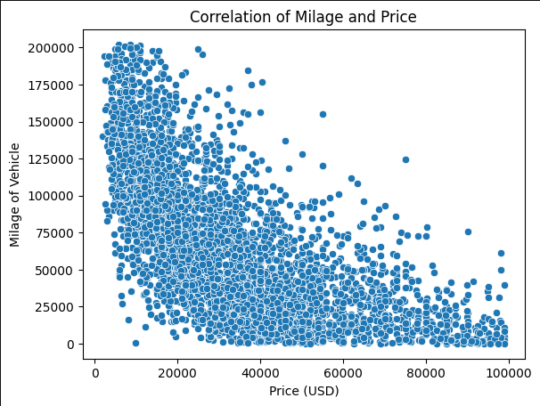
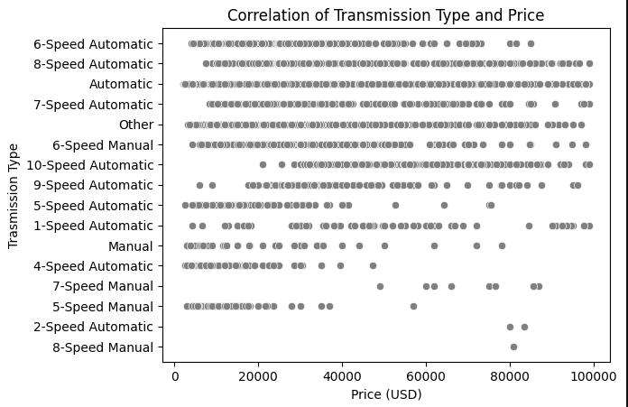
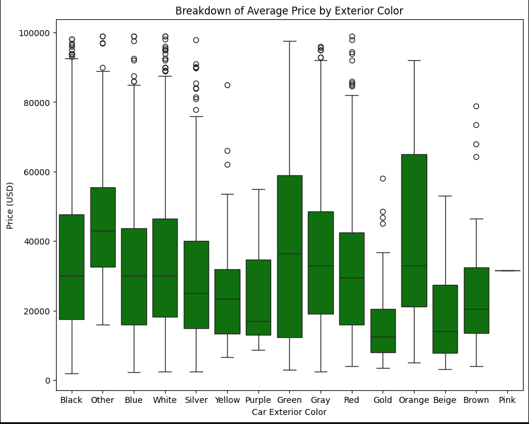

# Used Car Pricing Prediction Models

## Problem Statement
- In This analysis I will be preping a Used Car Dataset for use in a Linear Regression Model to predict the price of each car. 
- I hope to show that a successful model can be built with this data to show that further data collection of this type would be useful for anyone intrested in Car statistics or linear regression modeling.

  
## Data Dictionary
The full data dictionary along with other relevant information can be found here [Data Dictionary](https://www.kaggle.com/datasets/taeefnajib/used-car-price-prediction-dataset)

## Executive Summary

### Data Cleaning Steps
The data presented was delivered in such a way that most features required some sort of data extraction to create a useable feature. 
1. I started by extracting the numerical strings from the Milage and Price features making them intigers instead of objects.
   
2. Next I checked the features for null values useing a few different techinques to tackle them. The clean_title feature was complied with only 'yes' or 'NaN' values so that was changes to '0' and '1' to be useable.
   
3. I then removed a few outliers within the Price and Milage features that could have caused the models to overfit using the IQR method on the the top bound.

4. Scripts were created to extract usefull data from the Engine feature, and to consolidate the values for ext_col, int_col, and transmission. This created a more useable and uniform feature from each that helped the models consistency. 
   
### Key Visualizations

#### Visualization 1: [Milage and Price]
This chart shows us the comparisson of the cars Milage vs Price. It shows us that the Milage does have a negative correlation with the price that will be usefull for the models.

#### Visualization 2: [Transmission Type Affect on Price]
This chart shows a few trends with the tranmission type affecting price. In general Automatic transmissions seem to have a higher average price. With the speed also affecting the price in various ways.

#### Visualization 3: [Box Plot for Ext Color Pricing]
This last visualization is a box plot that shows the spread of pricing for each of the Ext Color options.

## Model Performance

### Model Selection
For this Anaylsis I tried both a Linear Regression model and a RandomForestRegressor Model to see which preformed best. With the Random Forest Regressor model performing better, I them performed some hyperparamater tuning to improve the RMSE and R2 score of the model.

### Evaluation Metrics
Model 1: A base Linear Regression model using default paramaters. 
Model 2: A base RandomForestRegressor model using default paramaters. 
Model 3: A RandomForestRegressor model with hyperparamater tuning to find the best options.
Model 4: The same model as 3 with some low corr features removed. 

| Model             | RMSE      |
|-------------------|-----------|
| Baseline          |21247.24476|
| Model 1           |12640.83466|
| Model 2           |10714.27693|
| Model 3           |10661.93078|
| Model 4           |13773.96719| 

Model 3 performed the best with the hyperparameter tuning on model 2 improving the score by a small margin. This model scored a 0.75 R2 score. 

## Conclusions/Recommendations
This model proves that you can create successful car price predictions with the features present in this dataset. I believe that with a larger sample size of cars in this data set you could create an even more accurate model. As is this model is useful for car enthusiasts and data enthusiasts but with more data a model could be created that would be useful for buisnesses who buy and sell vehicles. 

My Recommendation would be to continue gathering more data in this format for future model creation. 